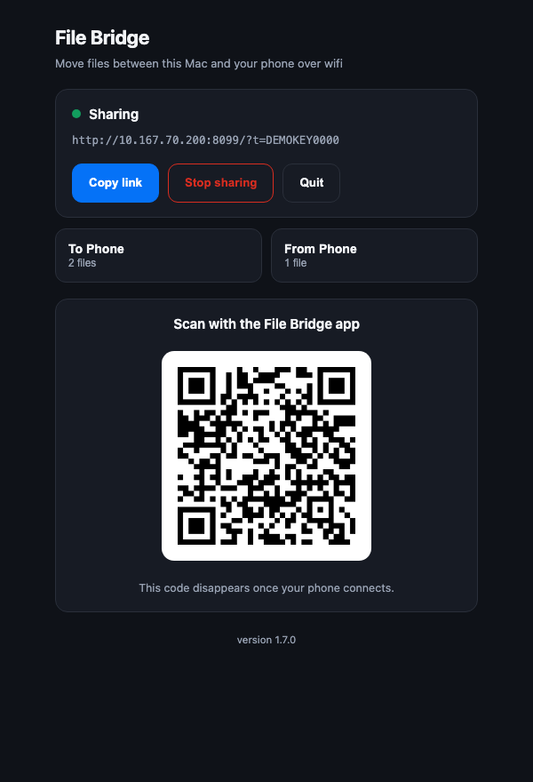
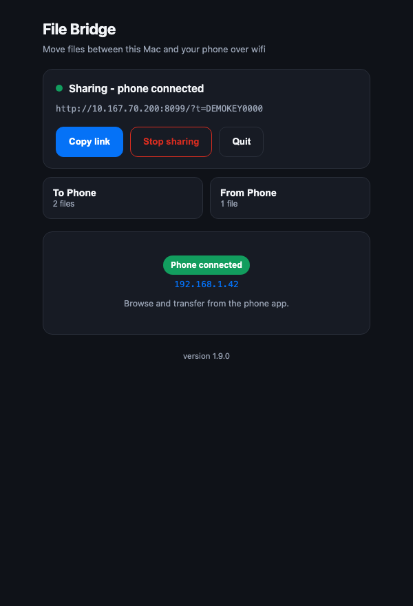
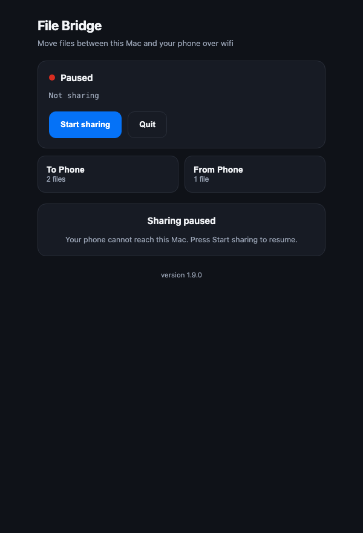
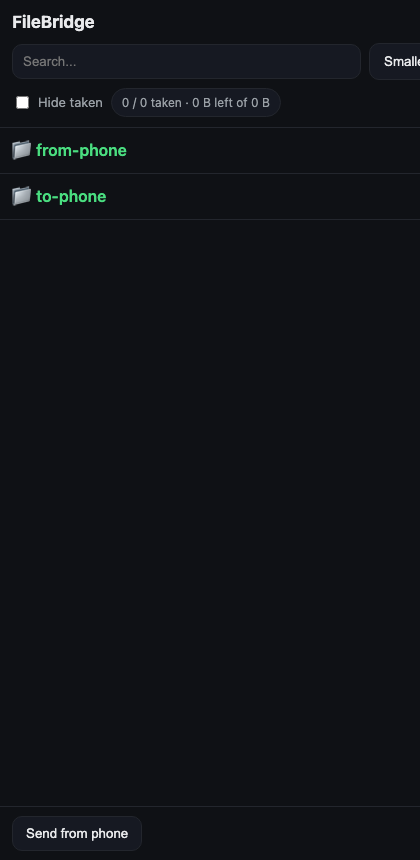

# File Bridge

Move files between a Mac and an Android phone over your own wifi. No cloud, no
account, no cable. A small Python server on the Mac, a native app on the phone,
and a QR code to connect them.

<p align="center">
  
  
</p>

Left: waiting to be scanned. Right: once the phone connects, the QR disappears
because it has done its job.

---

## What it does

- **Mac → phone.** Drop files in `~/FileBridge/to-phone`, tap them in the app.
- **Phone → Mac.** Pick files in the app, they land in `~/FileBridge/from-phone`.
- **Connect by QR.** Scan in-app, or with the phone's camera (deep link).
- **Resumable downloads.** Range requests, so a dropped wifi link continues
  instead of restarting a 900 MB file.
- **Remembers what you took**, per file, so a long list stays navigable.
- **Nothing leaves your network.** The phone talks straight to the Mac.

## Requirements

| | |
|---|---|
| Mac | macOS 11+, Python 3.9+ (the system one is fine). `ffprobe` optional, for durations |
| Phone | Android 7.0+ (API 24) |
| Both | The same wifi network |

Nothing to `pip install`. The server is standard library only.

## Install

**Mac app**

```bash
git clone https://github.com/sayanthns/filebridge.git
cd filebridge
./scripts/build-mac-app.sh
```

That assembles `FileBridge.app` into `~/Applications`. Open it, press
**Start sharing**. First launch may need right-click → **Open**, since the
bundle is unsigned.

**Phone app**

Grab `FileBridge-<version>.apk` from
[Releases](https://github.com/sayanthns/filebridge/releases) and install it, or
build from source:

```bash
./scripts/build-android.sh
```

The running server also serves its own APK, which is the easiest way to get it
onto a phone: open `http://<mac-ip>:8001/get?t=<key>` in the phone's browser.
The Mac panel shows that link.

## Using it

1. Open **File Bridge** on the Mac → **Start sharing**. A QR appears.
2. Open **File Bridge** on the phone → **Scan QR from Mac**. It connects itself.
3. Tap a file to download it. **Send** to upload. **Exit** to disconnect.
4. **Stop sharing** on the Mac pauses access; **Start sharing** resumes it.

## Screenshots

| Paused | Phone-facing web view |
|---|---|
|  |  |

The web view is a fallback: any browser on the network can use the same server
without installing the app.

> Phone-app screenshots are not in the repo yet — they need a real device, and
> the ones taken during development contained a live access key. Drop them into
> `docs/screenshots/` if you have a device to hand.

## How it fits together

```
   Mac                                            Phone
┌──────────────────────────────┐        ┌───────────────────────────┐
│ FileBridge.app               │        │ File Bridge (Kotlin)      │
│   launcher.sh                │        │   MainActivity            │
│     └─ spawns, then exits ───┼──┐     │     ├─ ZXing scanner      │
│                              │  │     │     ├─ DownloadService    │
│ filebridge.py  (HTTP :8001)  │◀─┘     │     └─ multipart upload   │
│   ├─ /connect   panel  local │◀───────┤ /api/status  (localhost)  │
│   ├─ /api/list  browse       │        │ /api/list    (token)      │
│   ├─ /file      Range reads  │◀───────┤ /file        (token)      │
│   └─ /api/upload             │◀───────┤ /api/upload  (token)      │
│                              │        │                           │
│ ~/FileBridge/to-phone   ─────┼───────▶│  Downloads/FileBridge/    │
│ ~/FileBridge/from-phone ◀────┼────────┤  (picked files)           │
└──────────────────────────────┘        └───────────────────────────┘
```

The launcher exits immediately and leaves the server in its own session. That
matters: while the launcher *was* the server, macOS considered the app running,
clicking its icon only activated a windowless process, and quitting it took a
Force Quit.

The Mac UI is HTML served by the server itself, shown in a chromeless Chrome
window. See [docs/ARCHITECTURE.md](docs/ARCHITECTURE.md) for why it is not a
native window, and for the rest of the design decisions.

## Security model

Worth understanding before you use it on a network you do not control.

- **A key in the URL** (`?t=…`) gates every phone-facing route. Without it,
  every device on the wifi could read the shared folder.
- **Local-only control.** `/connect`, `/qr.png`, `/api/status`, `/api/stop`,
  `/api/start`, `/api/quit` and `/api/open` answer **only** to `127.0.0.1`.
  They display the key or act on the Mac, so a phone must never reach them.
- **Path containment.** Served paths are confined to the shared folder. `..` is
  rejected; symlinks you place inside it *are* followed, deliberately, so you
  can link a media folder in.
- **Plain HTTP.** Traffic is unencrypted on your LAN. Fine at home; do not use
  it on café or conference wifi.
- **The key persists** in `~/.filebridge/key` so the phone stays paired across
  restarts. Delete that file to invalidate every paired device.

## Development

```
filebridge.py                  server + Mac control panel (stdlib only)
launcher.sh                    what Contents/MacOS/FileBridge runs
tools/qrgen.js                 QR via macOS CoreImage (JXA, no dependency)
tools/qrread.js                decodes a QR — used to verify generated codes
tools/make_qr.sh               reads the link from the log, renders the QR
android/                       Kotlin app, Gradle, no Android Studio needed
scripts/build-mac-app.sh       assembles FileBridge.app
scripts/build-android.sh       builds the debug APK
VERSIONS.md                    per-component changelog and why each fix exists
docs/ARCHITECTURE.md           design decisions, HTTP API, dead ends
HANDOFF.md                     current state, what is verified vs assumed, open items
```

Run the server directly while working on it:

```bash
python3 filebridge.py ~/FileBridge --port 8001 --token devkey
```

Then `http://127.0.0.1:8001/connect` for the panel, or
`http://127.0.0.1:8001/?t=devkey` for the browse view.

**Three independent versions** — server, Mac app, Android app — because they
talk over a stable HTTP API and rarely need to move together. Bump only what
changed, and always bump Android's `versionCode` or the APK will not install
over the previous one. See [VERSIONS.md](VERSIONS.md).

Picking this up cold? Start with **[HANDOFF.md](HANDOFF.md)** — it separates what
is measured from what is only believed to work, and lists this machine's quirks
(a broken `swiftc`, a Tk that renders nothing, a TCC-protected `~/Documents`).

## Known limits

- **Android only.** No iOS app; iPhones can use the web view instead.
- **Same network required.** No relay, no internet fallback.
- **The APK is debug-signed.** It installs and upgrades fine, but Play Store
  distribution would need a release keystore.
- **No Dock tile of its own.** The Mac app is a launcher that exits, so the
  panel window belongs to Chrome. Drag the app to the Dock for a shortcut.
- **Durations need `ffprobe`.** Without it, files simply show no duration.

## License

MIT — see [LICENSE](LICENSE).
